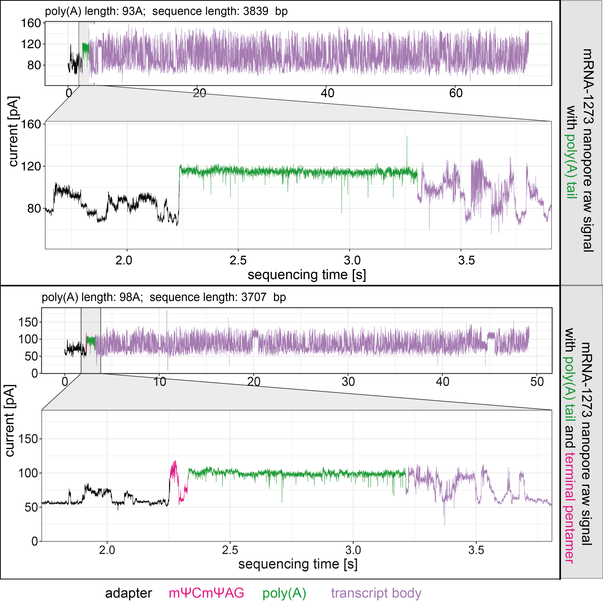
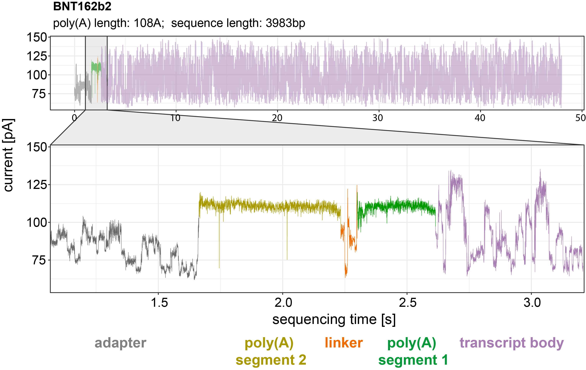

# Nanopolish


# Nanopolish for mRNA-1273 and BNT162b2 (segmented poly(A)

This is the version of Nanopolish containing additional subprograms:
1. nanopolish polya-moderna for identification of m&#936;Cm&#936;AG pentamer at the 3'end of mRNA-1273 vaccine poly(A) tail (see the picture below for example)
2. nanopolish polya-pfizer for proper segmentation of composite poly(A) tails (like in the BNT162b2 mRNA vaccine). 

This code was used for the identification of pentamer containing mRNA-1273 reads, described in our [recent preprint](https://www.biorxiv.org/content/10.1101/2022.12.01.518149v1) and analysis of poly(A) tails in BNT162b2 vaccine (manuscript in revision).





m&#936;Cm&#936;AG emissions were modelled with Mixture Gaussian, using manually selected reads from direct RNA sequencing run of mRNA-1273 or BNT162b2.  

## Installation 

Modified nanopolish can be installed in the same way as original nanopolish software (please see below for instructions). After succesfull compliation new subprograms will appear: polya-moderna and polya-pfizer. 

## nanopolish polya-moderna

Usage will be demonstrated based on the test data located in [mRNA-1273_BNT162b2_test_data/mRNA-1273/](mRNA-1273_BNT162b2_test_data/mRNA-1273/).

Data were basecalled using Guppy 6.0.0, with the following command:
```bash
guppy_basecaller -i raw/ -s guppy/ -x cuda:0 --flowcell FLO-MIN106 --kit SQK-RNA002 --recursive --records_per_fastq 0 --trim_strategy none --reverse_sequence on --u_substitution on --fast5_out --disable_pings --disable_qscore_filtering
```

1. Index fast5 files using nanopolish index:
    ```bash
    nanopolish index -d guppy/workspace/ -s guppy/sequencing_summary.txt guppy/fastq_runid_8b7a566cce7dbf659ba14e2b8662fa6a8331a9f6_0_0.fastq
    ```
2. Map sequnces to the reference using [minimap2](https://github.com/lh3/minimap2) and samtools (for sorted output)
    ```
    minimap2 -ax map-ont -t 10 --secondary=no mRNA-1273.fasta guppy/fastq_runid_8b7a566cce7dbf659ba14e2b8662fa6a8331a9f6_0_0.fastq | samtools view -b | samtools sort -o mapping/mRNA-1273_mapping_sorted.bam
    samtools index mapping/mRNA-1273_mapping_sorted.bam
    ```
3. Run nanopolish polya-moderna
    ```
    nanopolish polya-moderna -r guppy/fastq_runid_8b7a566cce7dbf659ba14e2b8662fa6a8331a9f6_0_0.fastq -b mapping/mRNA-1273_mapping_sorted.bam -g mRNA-1273.fasta -t 10 > nanopolish_moderna_out.tsv
    #[post-run summary] total reads: 1000, unparseable: 0, qc fail: 39, could not calibrate: 72, no alignment: 2, bad fast5: 0 
    ```

As a result of nanopolish polya-moderna additional columns appear in the output [nanopolish_moderna_out.tsv](mRNA-1273_BNT162b2_test_data/mRNA-1273/nanopolish_moderna_out.tsv):

* mod_start - where m&#936;Cm&#936;AG starts in a raw signal
* sum_length - sum of poly(A) + CUAG length
* mod_length - calculated m&#936;Cm&#936;AG length (inprecise)
* mod_qc_tag - either "CUAG" (pentamer was found), "TOOSHORT" (signal perutbation detected at the end of 3'end but too short - possible artifact), or "NONE" - no penamter detected

## nanopolish polya-pfizer

Nanopolish polya-pfizer can be run exacly the same as nanopolish polya-moderna (above), but reads should be mapped to BNT162b2 reference. Usage will be demonstrated based on the test data located in [mRNA-1273_BNT162b2_test_data/BNT162b2/](mRNA-1273_BNT162b2_test_data/BNT162b2/).

Data were basecalled the same as above, using Guppy 6.0.0, with the following command:
```bash
guppy_basecaller -i raw/ -s guppy/ -x cuda:0 --flowcell FLO-MIN106 --kit SQK-RNA002 --recursive --records_per_fastq 0 --trim_strategy none --reverse_sequence on --u_substitution on --fast5_out --disable_pings --disable_qscore_filtering
```

1. Index fast5 files using nanopolish index:
    ```bash
    nanopolish index -d guppy/workspace/ -s guppy/sequencing_summary.txt guppy/fastq_runid_a41505424a2e29d098edda769568b7bcc2ea1419_0_0.fastq
    ```
2. Map sequnces to the reference using [minimap2](https://github.com/lh3/minimap2) and samtools (for sorted output)
    ```
    minimap2 -ax map-ont -t 10 --secondary=no BNT162b2.fasta guppy/fastq_runid_a41505424a2e29d098edda769568b7bcc2ea1419_0_0.fastq | samtools view -b | samtools sort -o mapping/BNT162b2_mapping_sorted.bam
    samtools index mapping/BNT162b2_mapping_sorted.bam 
    ```
3. Run nanopolish polya-pfizer
    ```
    nanopolish polya-pfizer -r guppy/fastq_runid_a41505424a2e29d098edda769568b7bcc2ea1419_0_0.fastq -b mapping/BNT162b2_mapping_sorted.bam -g BNT162b2.fasta -t 10 > nanopolish_pfizer_out.tsv 
    #[post-run summary] total reads: 1000, unparseable: 0, qc fail: 20, could not calibrate: 14, no alignment: 0, bad fast5: 0
    ```

As a result of nanopolish polya-pfizer additional columns appear in the output [nanopolish_pfizer_out.tsv](mRNA-1273_BNT162b2_test_data/BNT162b2/nanopolish_pfizer_out.tsv):
* linker_start - position of start of the linker in a raw signal
* poly2_start - position of start of the second poly(A) segment in a raw signal
* polya1_length - length of first poly(A) segment
* polya2_length - length of second poly(A) segment
* linker_length - length of poly(A) linker


---
Original nanopolish README below
---

## Nanopolish

Software package for signal-level analysis of Oxford Nanopore sequencing data. Nanopolish can calculate an improved consensus sequence for a draft genome assembly, detect base modifications, call SNPs and indels with respect to a reference genome and more (see Nanopolish modules, below).

## Release notes
* 0.14.0: support modification bam files, compile on M1 apple hardware, support [SLOW5](https://github.com/hasindu2008/slow5lib) files

* 0.13.3: fix conda build issues, better handling of VBZ-compressed files, integration of module for [nano-COP](https://www.nature.com/articles/s41596-020-00469-y)

* 0.13.2: fix memory leak when loading signal data

* 0.13.1: fix `nanopolish index` performance issue for some barcoding runs

* 0.13.0: modify HMM transitions to allow the balance between insertions and deletions to be changed depending on mode (consensus vs reference variants)

* 0.12.5: make SupportFractionByStrand calculation consistent with SupportFraction

* 0.12.4: add SupportFractionByStrand and SOR to VCF

* 0.12.3: fix hdf5 file handle leak

* 0.12.2: add RefContext info to VCF output of `nanopolish variants`

* 0.12.1: improve how `nanopolish index` handles summary files, add support for selecting reads by BAM read group tags (for `nanopolish variants`)

* 0.12.0: live methylation calling, methylation LLR threshold changes as described [here](http://simpsonlab.github.io/2020/03/03/nanopolish-v0.12.0/)

* 0.11.1: `nanopolish polya` now supports SQK-RNA-002 kits with automatic backwards-compatibility with SQK-RNA-001

* 0.11.0: support for multi-fast5 files. `nanopolish methyltrain` now subsamples input data, improving speed and memory usage

* 0.10.2: added new program `nanopolish polya` to estimate the length of poly-A tails on direct RNA reads (by @paultsw)

* 0.10.1: `nanopolish variants --consensus` now only outputs a VCF file instead of a fasta sequence. The VCF file describes the changes that need to be made to turn the draft sequence into the polished assembly. A new program, `nanopolish vcf2fasta`, is provided to generate the polished genome (this replaces `nanopolish_merge.py`, see usage instructions below). This change is to avoid issues when merging segments that end on repeat boundaries (reported by Michael Wykes and Chris Wright).

## Dependencies

A compiler that supports C++11 is needed to build nanopolish. Development of the code is performed using [gcc-4.8](https://gcc.gnu.org/gcc-4.8/).

By default, nanopolish will download and compile all of its required dependencies. Some users however may want to use system-wide versions of the libraries. To turn off the automatic installation of dependencies set `HDF5=noinstall`, `EIGEN=noinstall`, `HTS=noinstall` or `MINIMAP2=noinstall` parameters when running `make` as appropriate. The current versions and compile options for the dependencies are:

* [libhdf5-1.8.14](http://www.hdfgroup.org/HDF5/release/obtain5.html) compiled with multi-threading support `--enable-threadsafe`
* [eigen-3.2.5](http://eigen.tuxfamily.org)
* [htslib-1.15.1](http://github.com/samtools/htslib)
* [minimap2-fe35e67](http://github.com/lh3/minimap2)
* [slow5lib-3680e17](https://github.com/hasindu2008/slow5lib)

In order to use the additional python3 scripts within `/scripts`, install the dependencies via

```
pip install -r scripts/requirements.txt --user
```


## Installation instructions

### Installing the latest code from github (recommended)

You can download and compile the latest code from github as follows:

```
git clone --recursive https://github.com/jts/nanopolish.git
cd nanopolish
make
```

### Installing a particular release

When major features have been added or bugs fixed, we will tag and release a new version of nanopolish. If you wish to use a particular version, you can checkout the tagged version before compiling:

```
git clone --recursive https://github.com/jts/nanopolish.git
cd nanopolish
git checkout v0.9.2
make
```

## Nanopolish modules

The main subprograms of nanopolish are:

```
nanopolish call-methylation: predict genomic bases that may be methylated
nanopolish variants: detect SNPs and indels with respect to a reference genome
nanopolish variants --consensus: calculate an improved consensus sequence for a draft genome assembly
nanopolish eventalign: align signal-level events to k-mers of a reference genome
```

## Analysis workflow examples

### Data preprocessing

Nanopolish needs access to the signal-level data measured by the nanopore sequencer. The first step of any nanopolish workflow is to prepare the input data by telling nanopolish where to find the signal files. If you ran Albacore 2.0 on your data you should run `nanopolish index` on your input reads (-d can be specified more than once if using multiple runs):

```
# Index the output of the basecaller
nanopolish index -d /path/to/raw_fast5s/ -s sequencing_summary.txt basecalled_output.fastq # for FAST5 inout
nanopolish index basecalled_output.fastq --slow5 signals.blow5 # for SLOW5 input
```

The `-s` option tells nanopolish to read the `sequencing_summary.txt` file from Albacore to speed up indexing. Without this option `nanopolish index` is extremely slow as it needs to read every fast5 file individually. If you basecalled your run in parallel, so you have multiple `sequencing_summary.txt` files, you can use the `-f` option to pass in a file containing the paths to the sequencing summary files (one per line). When using SLOW5 files as the input (FAST5 can be converted to SLOW5 using [slow5tools](https://github.com/hasindu2008/slow5tools)), `-s` option is not required and does not affect indexing performance.

### Computing a new consensus sequence for a draft assembly

The original purpose of nanopolish was to compute an improved consensus sequence for a draft genome assembly produced by a long-read assembly like [canu](https://github.com/marbl/canu). This section describes how to do this, starting with your draft assembly which should have megabase-sized contigs. We've also posted a tutorial including example data [here](http://nanopolish.readthedocs.io/en/latest/quickstart_consensus.html).

```
# Index the draft genome
bwa index draft.fa

# Align the basecalled reads to the draft sequence
bwa mem -x ont2d -t 8 draft.fa reads.fa | samtools sort -o reads.sorted.bam -T reads.tmp -
samtools index reads.sorted.bam
```

Now, we use nanopolish to compute the consensus sequence (the genome is polished in 50kb blocks and there will be one output file per block). We'll run this in parallel:

```
python3 nanopolish_makerange.py draft.fa | parallel --results nanopolish.results -P 8 \
    nanopolish variants --consensus -o polished.{1}.vcf -w {1} -r reads.fa -b reads.sorted.bam -g draft.fa -t 4 --min-candidate-frequency 0.1
```

This command will run the consensus algorithm on eight 50kbp segments of the genome at a time, using 4 threads each. Change the ```-P``` and ```--threads``` options as appropriate for the machines you have available.

After all polishing jobs are complete, you can merge the individual 50kb segments together back into the final assembly:

```
nanopolish vcf2fasta -g draft.fa polished.*.vcf > polished_genome.fa
```

## Calling Methylation

nanopolish can use the signal-level information measured by the sequencer to detect 5-mC as described [here](https://www.nature.com/articles/nmeth.4184). We've posted a tutorial on how to call methylation [here](http://nanopolish.readthedocs.io/en/latest/quickstart_call_methylation.html).

## To run using docker

First build the image from the dockerfile:
```
docker build .
```
Note the uuid given upon successful build.
Then you can run nanopolish from the image:
```
docker run -v /path/to/local/data/data/:/data/ -it :image_id  ./nanopolish eventalign -r /data/reads.fa -b /data/alignments.sorted.bam -g /data/ref.fa
```

## Credits and Thanks

The fast table-driven logsum implementation was provided by Sean Eddy as public domain code. This code was originally part of [hmmer3](http://hmmer.janelia.org/). Nanopolish also includes code from Oxford Nanopore's [scrappie](https://github.com/nanoporetech/scrappie) basecaller. This code is licensed under the MPL.
